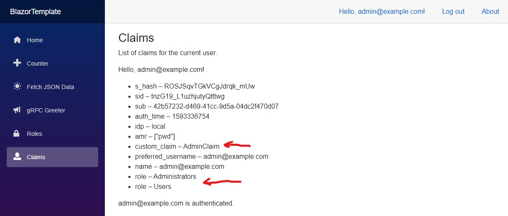

# Blazor WASM, IdentityServer4 with Multiple Roles, Additional User Claim(s) &amp; gRPC Roles Authorization

 _(Whoa Nelly, this thing does work!)_ 😉

### This .NET 5 Preview repo combines two repo's by **@javiercn**:

1. https://github.com/javiercn/BlazorAuthRoles
2. https://github.com/javiercn/BlazorGrpcAuth

(_To run this repo you'll need **.NET 5.0 [SDK](https://dotnet.microsoft.com/download/dotnet-core)** and **Visual Studio [Preview](https://docs.microsoft.com/en-us/visualstudio/releases/2019/release-notes-preview)**_)

I've added Role Authorization to the -[Greeter](BlazorTemplate/Client/Pages/GreeterGrpc.razor) -[gRPC](BlazorTemplate/Shared/Contracts/greeter.proto) -[Service](BlazorTemplate/Server/GrpcServices/GreeterService.cs):

_Server/[Startup.cs](BlazorTemplate/Server/Startup.cs)_

    endpoints
        .MapGrpcService<GreeterService>()
        .RequireAuthorization(new AuthorizeAttribute { Roles = "Administrator"})
        .EnableGrpcWeb();
        
I've also added a _Client/[Claims.razor](BlazorTemplate/Client/Pages/Claims.razor)_ page with a list of the current user's claims.

It uses Kestrel as the default webserver, a SQLite database and is "*CTRL-F5'able*" without any further configuration.

You can delete de SQLite database and migrations folder if you want and use the following commands in Visual Studio's Package Manager Console to re-create the db.

1. Add-Migration InitialCreate
2. Update-Database

At first run the app will create 2 users (_if they don't exist, see: Server/[SeedData.cs](BlazorTemplate/Server/Data/SeedData.cs)_)

1. `admin@example.com` / `Qwerty1234#`
2. `user@example.com` / `Qwerty1234#`

and 2 roles: 

1. Users
2. Administrators

The 'Administrators' &amp; 'Users' roles will be assigned to: `admin@example.com`

The 'Users' role will be assigned to: `user@example.com`

### ~~TODO~~ DONE❗ - Additional Claim(s)
(_By George, I think I've got it_)

1. I've extended ASP.NET Identity AspNetUsers table with an extra 'CustomClaim' field (_see: Server/Models/[ApplicationUser.cs](BlazorTemplate/Server/Models/ApplicationUser.cs)_).
2. Seeded a value to that `CustomClaim` field  in: _Server/Data/[SeedData.cs](BlazorTemplate/Server/Data/SeedData.cs)_
3. Added: _Server/[AppClaimsPrincipalFactory.cs](BlazorTemplate/Server/AppClaimsPrincipalFactory.cs)_
4. Modified: _Server/[Startup.cs](BlazorTemplate/Server/Startup.cs)_ to use `AppClaimsPrincipalFactory.cs`
5. When you run the app you'll see the `custom_claim` in the _Client/Pages/[Claims.razor](BlazorTemplate/Client/Pages/Claims.razor)_ page

### TODO - Claims Profile Service

To use Name and Role claims with API authorization and Identity Server you can use one of the [following approaches](https://docs.microsoft.com/en-us/aspnet/core/blazor/security/webassembly/hosted-with-identity-server#configure-identity-server) (_MS Docs_)

1. API authorization options
2. Profile Service

I'm using the (_first_) 'API authorization options' now but I've included _Server/[ProfileService.cs](BlazorTemplate/Server/ProfileService.cs)_ and included (_commented_) code in _Server/[Startup.cs](BlazorTemplate/Server/Startup.cs)_ to use that, but I haven't got it working yet.

_Server/[ProfileService.cs](BlazorTemplate/Server/ProfileService.cs)_

	namespace BlazorTemplate.Server
	{
		public class ProfileService : IProfileService
		{
			public ProfileService()
			{
			}

			public Task GetProfileDataAsync(ProfileDataRequestContext context)
			{
				var nameClaim = context.Subject.FindAll(JwtClaimTypes.Name);
				context.IssuedClaims.AddRange(nameClaim);

				var roleClaims = context.Subject.FindAll(JwtClaimTypes.Role);
				context.IssuedClaims.AddRange(roleClaims);

				return Task.CompletedTask;
			}

			public Task IsActiveAsync(IsActiveContext context)
			{
				return Task.CompletedTask;
			}
		}
	}

_Server/[Startup.cs](BlazorTemplate/Server/Startup.cs)_

	///
	// Or this (Use a Profile Service)
	// Roles seem to work, Client displays them, but I can't add a Role: 403 Forbidden, Test with gRPC Authorization (Role=Administrators) as well.
	// See: https://docs.microsoft.com/en-us/aspnet/core/blazor/security/webassembly/hosted-with-identity-server?tabs=visual-studio#profile-service
	///
	//services.AddIdentityServer()
	//    .AddApiAuthorization<ApplicationUser, ApplicationDbContext>();
	//services.AddTransient<IProfileService, ProfileService>();

