### IMPORTANT


It uses Kestrel as the default webserver, a SQLite database and is "*CTRL-F5'able*" without any further configuration.

You can delete de SQLite database and migrations folder if you want and use the following commands in Visual Studio's Package Manager Console to re-create the db.

1. Add-Migration InitialCreate
2. Update-Database

At first run the app will create 2 users (_if they don't exist, see: Server/[SeedData.cs](BlazorTemplate/Server/Data/SeedData.cs)_)

1. `admin@example.com` / `Qwerty1234#`
2. `user@example.com` / `Qwerty1234#`

and 2 roles: 

1. Users
2. Administrators

The 'Administrators' &amp; 'Users' roles will be assigned to: `admin@example.com`

The 'Users' role will be assigned to: `user@example.com`

_Server/[ProfileService.cs](BlazorTemplate/Server/ProfileService.cs)_

```csharp
 public ProfileService(UserManager<ApplicationUser> userManager, IUserClaimsPrincipalFactory<ApplicationUser> claimsFactory)
        {
            _userManager = userManager;
            _claimsFactory = claimsFactory;
        }

        public async Task GetProfileDataAsync(ProfileDataRequestContext context)
        {
            var sub = context.Subject.GetSubjectId();
            var user = await _userManager.FindByIdAsync(sub);
            var principal = await _claimsFactory.CreateAsync(user);
            var claims = principal.Claims.ToList();
            
            var nameClaim = context.Subject.FindAll(JwtClaimTypes.Name);
            
            var roles = await _userManager.GetRolesAsync(user);
            var roleClaims = roles.Select(role => new Claim(JwtClaimTypes.Role, role));
            
            claims = claims.Where(claim => context.RequestedClaimTypes.Contains(claim.Type)).ToList();

            // Add custom claims in token here based on user properties or any other source
            claims.Add(new Claim("username", user.UserName ?? string.Empty));
            claims.AddRange(nameClaim);
            claims.AddRange(roleClaims); 
            context.IssuedClaims = claims;
        }
```


# Alexa Integration 
## Code Setup
_Server/Controllers/[AlexaSkillController.cs](BlazorTemplate/Server/Controllers/AlexaSkillController.cs)_

```csharp
	  [HttpPost("api/AlexaSkill/Request")]
        public IActionResult HandleResponse([FromBody] SkillRequest input)

        {

            var requestType = input.GetRequestType();
            SkillResponse response = null;

            var name = "";
            var jwtEncodedString = input.Session.User.AccessToken;
            if (jwtEncodedString is null)
            {
                response = ResponseBuilder.TellWithLinkAccountCard("You are not currently linked to this skill. Please go into your Alexa app and sign in.");
                response.Response.ShouldEndSession = true;

                return new OkObjectResult(response);
            }


            var token = new JwtSecurityToken(jwtEncodedString: jwtEncodedString);
            var claims = token.Claims;
            name = claims.First(c => c.Type == "name").Value;


            if (requestType == typeof(LaunchRequest))
            {
                response = ResponseBuilder.Tell($"Welcome to Blazor News {name}!");
                response.Response.ShouldEndSession = false;
            }

            // return information from an intent
            else if (requestType == typeof(IntentRequest))
            {
                // do some intent-based stuff
                var intentRequest = input.Request as IntentRequest;
                if (intentRequest.Intent.Name.Equals("news"))
                {
                    // get the pull requests
                    var news = GetNews();

                    if (news == 0)
                        response = ResponseBuilder.Tell("We have no blazor news at this time.");
                    else
                        response = ResponseBuilder.Tell("There are " + news.ToString() + " blazor news articles.");

                    response.Response.ShouldEndSession = false;
                }
                else
                {
                    response = ResponseBuilder.Ask("I don't understand. Can you please try again?", null);
                    response.Response.ShouldEndSession = false;

                }
            }
            else if (requestType == typeof(SessionEndedRequest))
            {
                response = ResponseBuilder.Tell("See you next time!");
                response.Response.ShouldEndSession = true;
            }

            return new OkObjectResult(response);
        }

        private static int GetNews()
        {
            return 3;
        }

```

_Server/[Startup.cs](BlazorTemplate/Server/Startup.cs)_

changed made in StartUp.cs
```csharp
            var alexaVendor = Configuration["Alexa:BlazorNews:VendorId"];
            var alexaSecretText = "AlexaBlazorNewsSecret"; // I use this secret under the Alexa configuration.
            var client = new IdentityServer4.Models.Client
            {
                ClientId = "AlexaBlazorNews",
                ClientName = "AlexaBlazorNews",
                Enabled = true,
                AllowedGrantTypes = GrantTypes.Code,
                AllowAccessTokensViaBrowser = true,
                RequireConsent = false,
                RequirePkce = false,
                RequireClientSecret = true,
                AllowRememberConsent = true,
                ClientSecrets = {new Secret(alexaSecretText.Sha256()) },
                RedirectUris =
                {
                    "https://pitangui.amazon.com/api/skill/link/" + alexaVendor,
                    "https://layla.amazon.com/api/skill/link/" + alexaVendor,
                    "https://alexa.amazon.co.jp/api/skill/link/"+alexaVendor
                },
                PostLogoutRedirectUris =
                {
                    "https://pitangui.amazon.com/api/skill/link/" + alexaVendor,
                    "https://layla.amazon.com/api/skill/link/" + alexaVendor,
                    "https://alexa.amazon.co.jp/api/skill/link/"+alexaVendor
                },
                AllowedScopes =
                {
                    IdentityServerConstants.StandardScopes.OpenId,
                    IdentityServerConstants.StandardScopes.Profile,
                    IdentityServerConstants.StandardScopes.Email,
                    IdentityServerConstants.StandardScopes.Phone,
                    "alexa"
                },
                AllowOfflineAccess = true,
                AccessTokenType = AccessTokenType.Jwt,
                
            };

            var clients = new List<IdentityServer4.Models.Client>();
            var configClients = Configuration.GetSection("IdentityServer:Clients")
                .Get<IdentityServer4.Models.Client[]>();

            clients.Add(client);
            clients.AddRange(configClients);
            
            services.AddIdentityServer()
                .AddApiAuthorization<ApplicationUser, ApplicationDbContext>(options =>
                {
                    options.IdentityResources["openid"].UserClaims.Add("role"); // Roles
                    options.ApiResources.Single().UserClaims.Add("role");
                    options.IdentityResources["openid"].UserClaims.Add("email");
                    options.ApiResources.Single().UserClaims.Add("email");
                    options.IdentityResources["openid"].UserClaims.Add("name");
                    options.ApiResources.Single().UserClaims.Add("name");
                    options.Clients.AddRange(clients.ToArray()); 
                });
            JwtSecurityTokenHandler.DefaultInboundClaimTypeMap.Remove("role");
            services.AddTransient<IProfileService, ProfileService>();
            services.AddControllersWithViews().AddNewtonsoftJson(); // newtonsoftjson is needed because alexa.net has not been migrated to Text.Json yet.
```

## NGrok Setup

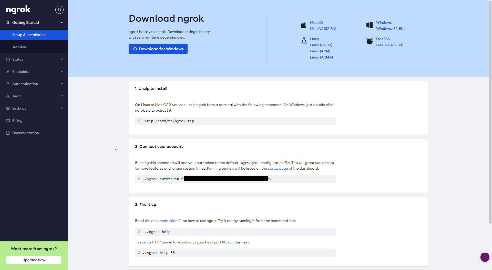
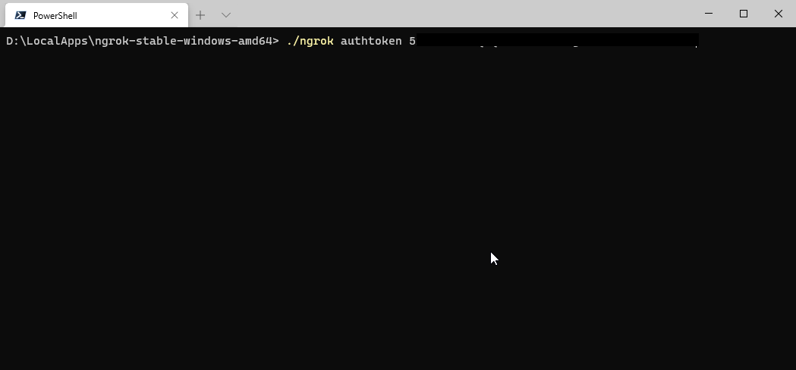
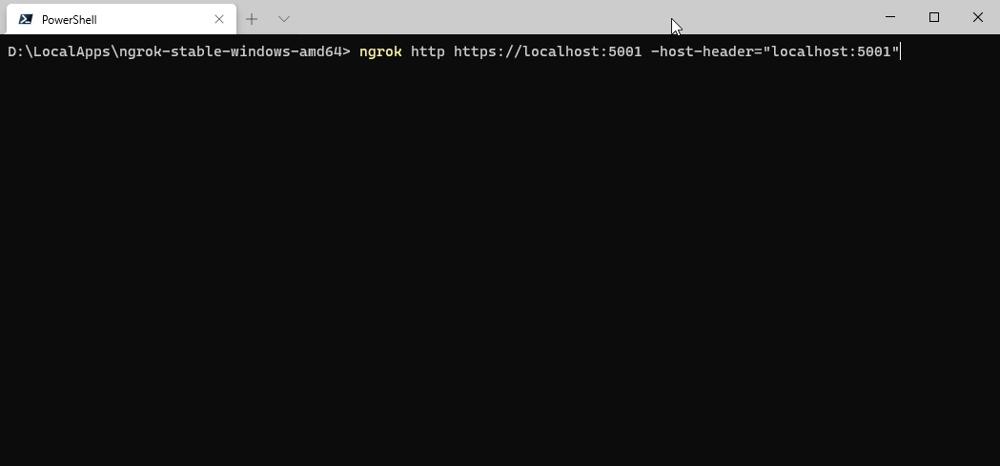
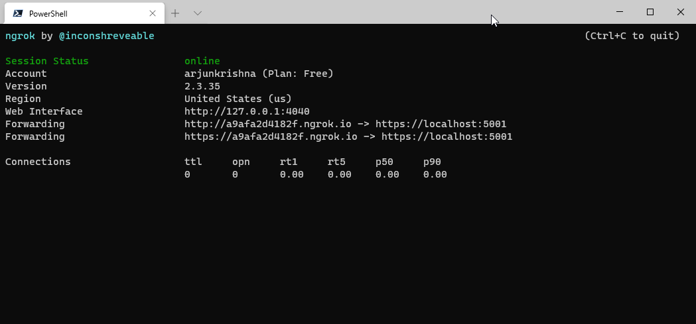

## Alexa Console Setup

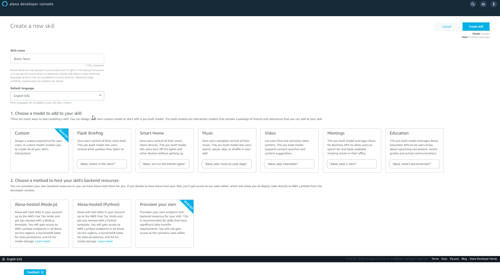
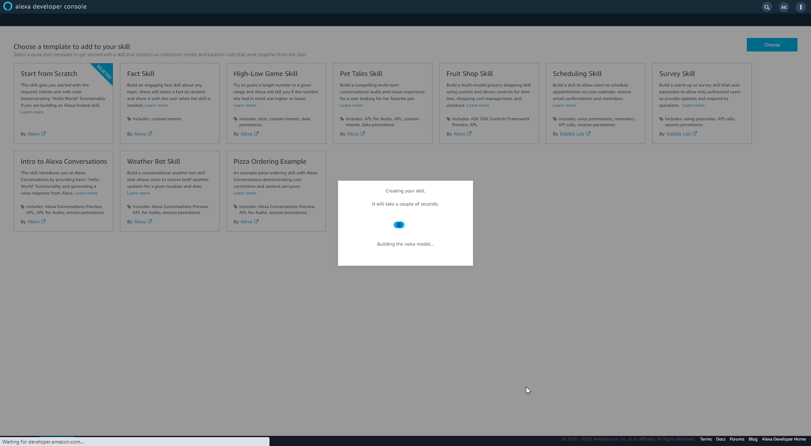
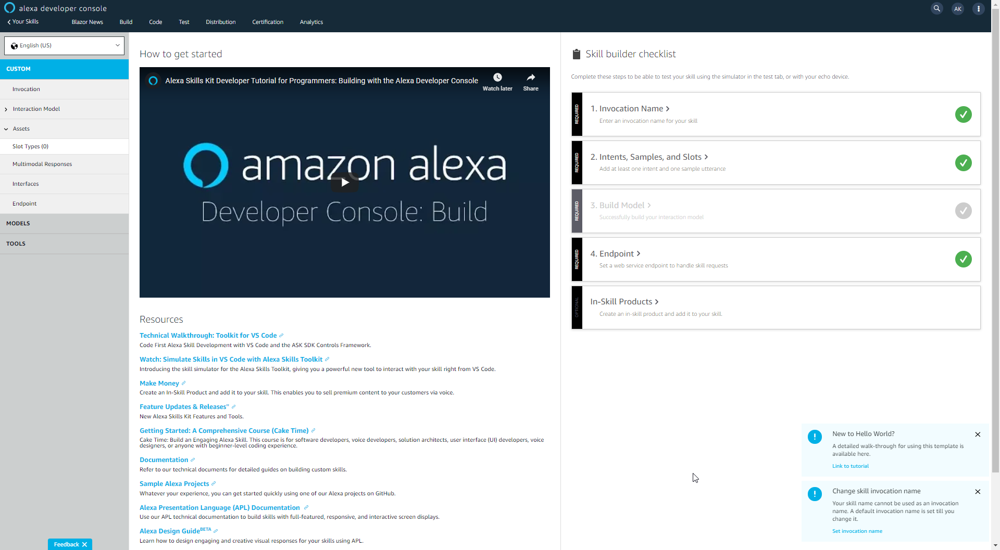
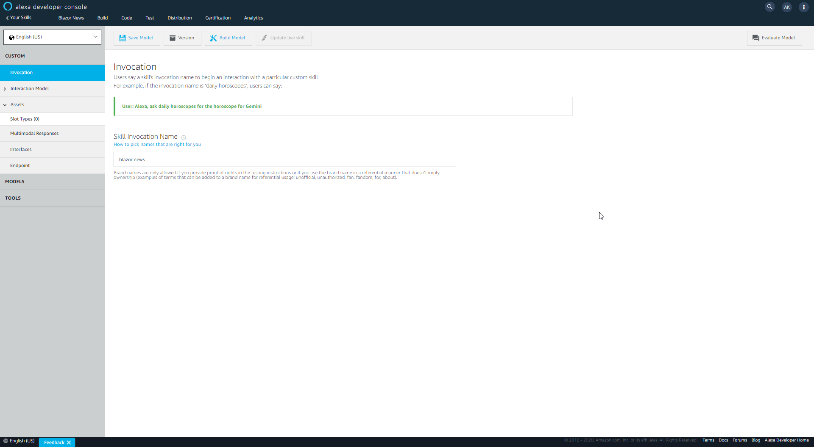
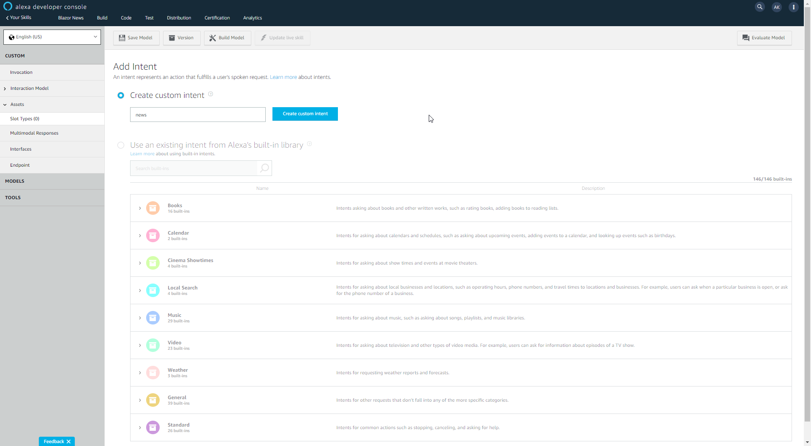
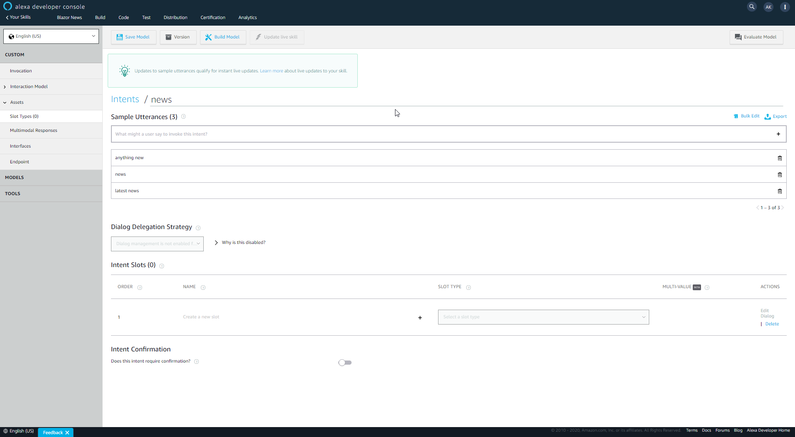

```
Default Region: https://a9afa2d4182f.ngrok.io/api/AlexaSkill/Request
```

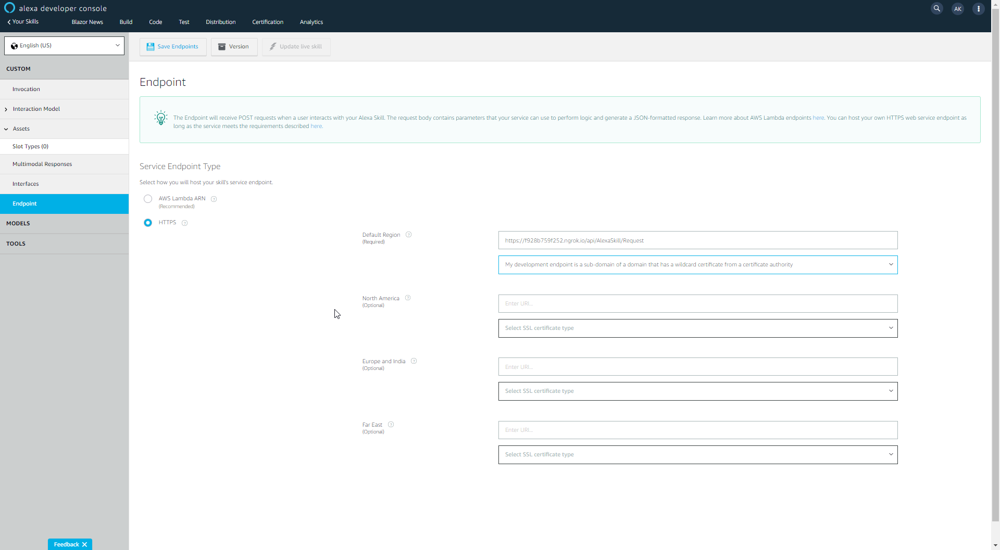

NGrok url was changed as I had restarted the Ngrok. VendorId is picked from here.

```
Web Authotization URI: https://a9afa2d4182f.ngrok.io/connect/authorize
Access Token URI: https://a9afa2d4182f.ngrok.io/connect/token
Client ID: AlexaBlazorNews
Your Secret: AlexaBlazorNewsSecret   (this will be used in the code)
Your Authentication Scheme: I changed it to Credentials in request body. Still did not work. Need to read more.
```
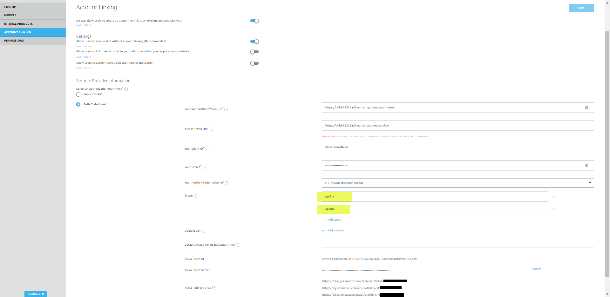


## User Secret Setup

VendorId setup
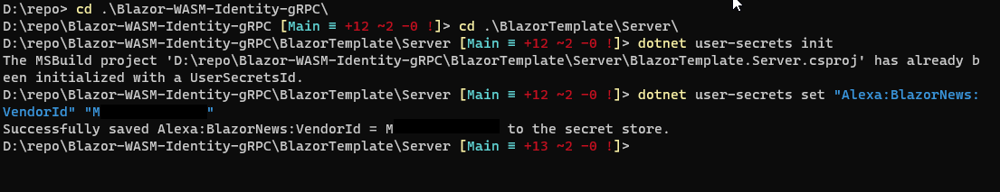

## Blazor WASM

Run Server Solution File from Visual Studio, NGrok will automatically pick it up.

## Testing
### Request


### Acount Linking via Alexa App

Linking Screen in Alexa App on iOS

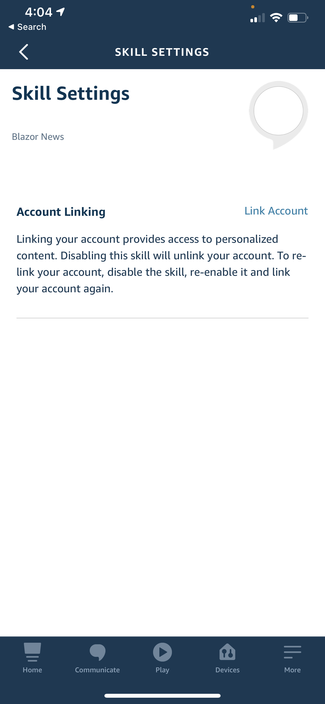

Login Screen in the App

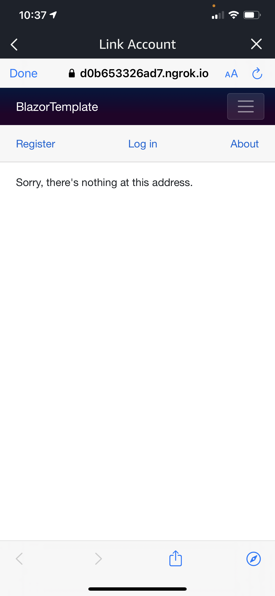

Alexa Account Linking Successful

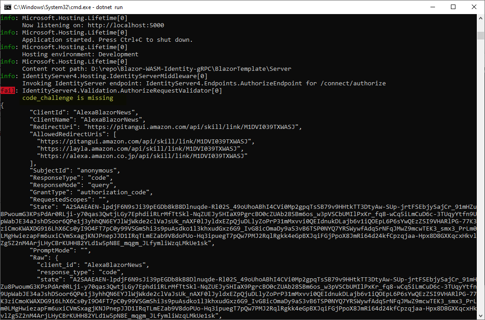