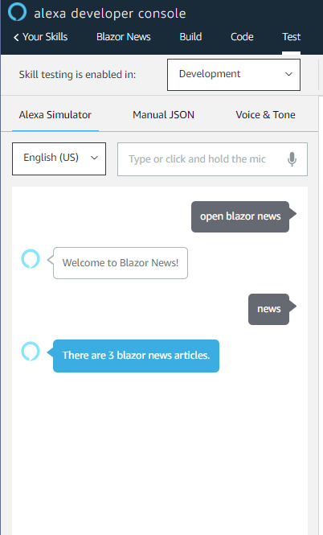
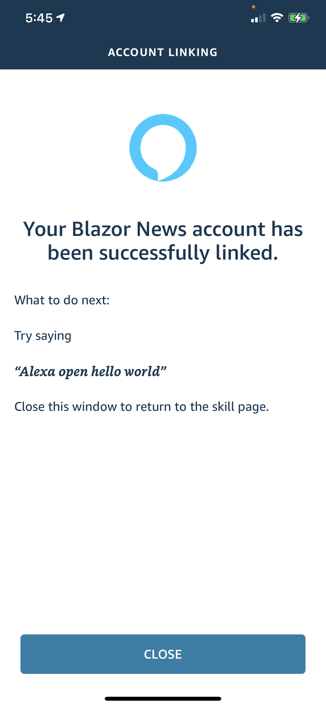

### IMPORTANT

BUG Solved, added: `.ToArray()` in _Client/[RolesClaimsPrincipalFactory.cs](BlazorTemplate/Client/RolesClaimsPrincipalFactory.cs)_ at [line 22](https://github.com/JeepNL/Blazor-WASM-Identity-gRPC/commit/7fa53fb695a6df6735f32f736e9abf89a84837be)

# Blazor WASM, IdentityServer4 with Multiple Roles, Additional User Claim(s) &amp; gRPC Roles Authorization &amp; Alexa Integration


 _(Whoa Nelly, this thing does work!)_ 😉


### This .NET 5 Preview repo combines two repo's by **@javiercn**:

1. https://github.com/javiercn/BlazorAuthRoles
2. https://github.com/javiercn/BlazorGrpcAuth

(_To run this repo you'll need **.NET 5.0 [SDK](https://dotnet.microsoft.com/download/dotnet-core)** and **Visual Studio [Preview](https://docs.microsoft.com/en-us/visualstudio/releases/2019/release-notes-preview)**_)

I've added Role Authorization to the -[Greeter](BlazorTemplate/Client/Pages/GreeterGrpc.razor) -[gRPC](BlazorTemplate/Shared/Contracts/greeter.proto) -[Service](BlazorTemplate/Server/GrpcServices/GreeterService.cs):

_Server/[Startup.cs](BlazorTemplate/Server/Startup.cs)_

    endpoints
        .MapGrpcService<GreeterService>()
        .RequireAuthorization(new AuthorizeAttribute { Roles = "Administrator"})
        .EnableGrpcWeb();
        
I've also added a _Client/[Claims.razor](BlazorTemplate/Client/Pages/Claims.razor)_ page with a list of the current user's claims.

It uses Kestrel as the default webserver, a SQLite database and is "*CTRL-F5'able*" without any further configuration.

You can delete de SQLite database and migrations folder if you want and use the following commands in Visual Studio's Package Manager Console to re-create the db.

1. Add-Migration InitialCreate
2. Update-Database

At first run the app will create 2 users (_if they don't exist, see: Server/[SeedData.cs](BlazorTemplate/Server/Data/SeedData.cs)_)

1. `admin@example.com` / `Qwerty1234#`
2. `user@example.com` / `Qwerty1234#`

and 2 roles: 

1. Users
2. Administrators

The 'Administrators' &amp; 'Users' roles will be assigned to: `admin@example.com`

The 'Users' role will be assigned to: `user@example.com`

### ~~TODO~~ DONE❗ - Additional Claim(s)
(_By George, I think I've got it_)

1. I've extended ASP.NET Identity AspNetUsers table with an extra 'CustomClaim' field (_see: Server/Models/[ApplicationUser.cs](BlazorTemplate/Server/Models/ApplicationUser.cs)_).
2. Seeded a value to that `CustomClaim` field  in: _Server/Data/[SeedData.cs](BlazorTemplate/Server/Data/SeedData.cs)_
3. Added: _Server/[AppClaimsPrincipalFactory.cs](BlazorTemplate/Server/AppClaimsPrincipalFactory.cs)_
4. Modified: _Server/[Startup.cs](BlazorTemplate/Server/Startup.cs)_ to use `AppClaimsPrincipalFactory.cs`
5. When you run the app you'll see the `custom_claim` in the _Client/Pages/[Claims.razor](BlazorTemplate/Client/Pages/Claims.razor)_ page

### TODO - Claims Profile Service

To use Name and Role claims with API authorization and Identity Server you can use one of the [following approaches](https://docs.microsoft.com/en-us/aspnet/core/blazor/security/webassembly/hosted-with-identity-server#configure-identity-server) (_MS Docs_)

1. API authorization options
2. Profile Service

I'm using the (_first_) 'API authorization options' now but I've included _Server/[ProfileService.cs](BlazorTemplate/Server/ProfileService.cs)_ and included (_commented_) code in _Server/[Startup.cs](BlazorTemplate/Server/Startup.cs)_ to use that, but I haven't got it working yet.

_Server/[ProfileService.cs](BlazorTemplate/Server/ProfileService.cs)_

	namespace BlazorTemplate.Server
	{
		public class ProfileService : IProfileService
		{
			public ProfileService()
			{
			}

			public Task GetProfileDataAsync(ProfileDataRequestContext context)
			{
				var nameClaim = context.Subject.FindAll(JwtClaimTypes.Name);
				context.IssuedClaims.AddRange(nameClaim);

				var roleClaims = context.Subject.FindAll(JwtClaimTypes.Role);
				context.IssuedClaims.AddRange(roleClaims);

				return Task.CompletedTask;
			}

			public Task IsActiveAsync(IsActiveContext context)
			{
				return Task.CompletedTask;
			}
		}
	}

_Server/[Startup.cs](BlazorTemplate/Server/Startup.cs)_

	///
	// Or this (Use a Profile Service)
	// Roles seem to work, Client displays them, but I can't add a Role: 403 Forbidden, Test with gRPC Authorization (Role=Administrators) as well.
	// See: https://docs.microsoft.com/en-us/aspnet/core/blazor/security/webassembly/hosted-with-identity-server?tabs=visual-studio#profile-service
	///
	//services.AddIdentityServer()
	//    .AddApiAuthorization<ApplicationUser, ApplicationDbContext>();
	//services.AddTransient<IProfileService, ProfileService>();

# Alexa Integration Trial
## Code Setup
_Server/Controllers/[AlexaSkillController.cs](BlazorTemplate/Server/Controllers/AlexaSkillController.cs)_

```csharp
		[HttpPost("Request")]
        public IActionResult HandleResponse([FromBody] SkillRequest input)
        {
            var requestType = input.GetRequestType();
            SkillResponse response = null;

            //input.Context.System.User.AccessToken
            //input.Context.System.User.UserId;

            // return a welcome message
            if (requestType == typeof(LaunchRequest))
            {
                response = ResponseBuilder.Tell("Welcome to Blazor News!");
                response.Response.ShouldEndSession = false;
            }

            // return information from an intent
            else if (requestType == typeof(IntentRequest))
            {
                // do some intent-based stuff
                var intentRequest = input.Request as IntentRequest;
                 if (intentRequest.Intent.Name.Equals("news"))
                {
                    // get the pull requests
                    var news = GetNews();

                    if (news == 0)
                        response = ResponseBuilder.Tell("You have no pull requests at this time.");
                    else
                        response = ResponseBuilder.Tell("There are " + news.ToString() + " pull requests waiting for you at GitHub.com.");

                    response.Response.ShouldEndSession = false;
                }
                else
                {
                    response = ResponseBuilder.Ask("I don't understand. Can you please try again?", null);
                    response.Response.ShouldEndSession = false;

                }
            }
            else if (requestType == typeof(SessionEndedRequest))
            {
                response = ResponseBuilder.Tell("See you next time!");
                response.Response.ShouldEndSession = true;
            }

            return new OkObjectResult(response);
        }

		private static int GetNews()
        {
            return 3;
        }

```

_Server/[Startup.cs](BlazorTemplate/Server/Startup.cs)_

```csharp
  var alexaVendor = Configuration["Alexa:BlazorNews:VendorId"];
            var alexaSecretText = "AlexaBlazorNewsSecret";// I use this secret under the Alexa configuration.
            var client = new IdentityServer4.Models.Client
            {
                ClientId = "AlexaBlazorNews",
                ClientName = "Alexa",
                Enabled = true,
                AllowedGrantTypes = GrantTypes.Code,
                AllowAccessTokensViaBrowser = true,
                RequireConsent = false,
                AllowRememberConsent = true,
                ClientSecrets = { new Secret(alexaSecretText) },
                RedirectUris = {
        "https://pitangui.amazon.com/api/skill/link/"+alexaVendor,
        "https://layla.amazon.com/api/skill/link/"+alexaVendor
    },
                PostLogoutRedirectUris = {
        "https://pitangui.amazon.com/api/skill/link/"+alexaVendor,
        "https://layla.amazon.com/api/skill/link/"+alexaVendor
    },
                AllowedScopes =
    {
        IdentityServerConstants.StandardScopes.OpenId,
        IdentityServerConstants.StandardScopes.Profile,
        IdentityServerConstants.StandardScopes.Email,
        IdentityServerConstants.StandardScopes.Phone,
        "alexa"
    },
                AllowOfflineAccess = true,
                AccessTokenType = AccessTokenType.Jwt
            };

            var clients = new List<IdentityServer4.Models.Client>();
            var configClients = Configuration.GetSection("IdentityServer:Clients").Get<IdentityServer4.Models.Client[]>();

            clients.Add(client);
            clients.AddRange(configClients);

            
            services.AddIdentityServer()
                .AddApiAuthorization<ApplicationUser, ApplicationDbContext>(options =>
                {
                    options.IdentityResources["openid"].UserClaims.Add("role"); // Roles
                    options.ApiResources.Single().UserClaims.Add("role");
                    options.IdentityResources["openid"].UserClaims.Add("custom_claim"); // Custom Claim
                    options.ApiResources.Single().UserClaims.Add("custom_claim");
                    options.Clients.AddRange(clients.ToArray()); // added clients. trying to add alexa client as well
                });
```

## NGrok Setup


## Alexa Console Setup


```
Default Region: https://a9afa2d4182f.ngrok.io/api/AlexaSkill/Request
```


NGrok url was changed as I had restarted the Ngrok. VendorId is picked from here.

```
Web Authotization URI: https://a9afa2d4182f.ngrok.io/connect/authorize
Access Token URI: https://a9afa2d4182f.ngrok.io/connect/token
Client ID: AlexaBlazorNews
Your Secret: AlexaBlazorNewsSecret   (this will be used in the code)
Your Authentication Scheme: I changed it to Credentials in request body. Still did not work. Need to read more.
```


## User Secret Setup

VendorId setup


## Blazor WASM

Run Server Solution File from Visual Studio, NGrok will automatically pick it up.

## Testing
### Request


### Acount Linking via Alexa App

Linking Screen in Alexa App on iOS


Login Screen in the App


Alexa Account Linking Successful

